# Bedrock LLM Library Structure

The following Mermaid diagram illustrates the main components and their relationships within the bedrock_llm library:

```mermaid
classDiagram
    class LLMClient {
        +region_name: str
        +model_name: ModelName
        +retry_config: RetryConfig
        +bedrock_client
        +model_implementation: BaseModelImplementation
        +memory: List[MessageBlock]
        +generate()
        +generate_async()
        #get_model_implementation() BaseModelImplementation
    }

    class Agent {
        +tool_functions: Dict
        +max_iterations: int
        +tool() decorator
        +generate_and_action_async()
        #update_memory()
        -process_tool()
    }

    class BaseModelImplementation {
        <<abstract>>
        +prepare_request()*
        +prepare_request_async()*
        +parse_response()*
        +parse_stream_response()*
    }

    class ClaudeImplementation {
        +prepare_request()
        +prepare_request_async()
        +parse_response()
        +parse_stream_response()
    }

    class LlamaImplementation {
        +prepare_request()
        +prepare_request_async()
        +parse_response()
        +parse_stream_response()
    }

    class TitanImplementation {
        +prepare_request()
        +prepare_request_async()
        +parse_response()
        +parse_stream_response()
    }

    class MistralChatImplementation {
        +prepare_request()
        +prepare_request_async()
        +parse_response()
        +parse_stream_response()
    }

    class MistralInstructImplementation {
        +prepare_request()
        +prepare_request_async()
        +parse_response()
        +parse_stream_response()
    }

    class JambaInstructImplementation {
        +prepare_request()
        +prepare_request_async()
        +parse_response()
        +parse_stream_response()
    }

    class MessageBlock {
        +role: str
        +content: List[Union[TextBlock, ToolUseBlock, ToolResultBlock, ImageBlock]] | str
        +tool_calls: List[ToolCallBlock]
        +tool_calls_id: str
    }

    class TextBlock {
        +type: str
        +text: str
    }

    class ImageBlock {
        +type: str
        +source: Image
    }

    class ToolUseBlock {
        +type: str
        +id: str
        +name: str
        +input: Dict
    }

    class ToolResultBlock {
        +type: str
        +tool_use_id: str
        +is_error: bool
        +content: str
    }

    class ToolCallBlock {
        +id: str
        +type: str
        +function: Dict
    }

    class SystemBlock {
        +cache_control: CacheControl
    }

    class ModelConfig {
        +temperature: float
        +max_tokens: int
        +top_p: float
        +top_k: int
        +stop_requences: List[str]
        +number_of_responses: int
    }

    class RetryConfig {
        +max_retries: int
        +retry_delay: float
        +exponential_backogff: bool
    }

    class UserMetadata {
        +user_id: str
    }

    class Image {
        +type: str
        +media_type: str
        +data: str
    }

    class CacheControl {
        +value: str
    }

    class ToolMetadata {
        +name: str
        +description: str
        +input_schema: InputSchema
    }

    class InputSchema {
        +type: str
        +properties: Dict[str, PropertyAttr]
        +required: List[str]
    }

    class PropertyAttr {
        +type: str
        +enum: List[str]
        +description: str
    }



    LLMClient <|-- Agent
    LLMClient *-- BaseModelImplementation
    BaseModelImplementation <|-- ClaudeImplementation: implements
    BaseModelImplementation <|-- TitanImplementation: implements
    BaseModelImplementation <|-- LlamaImplementation: implements
    BaseModelImplementation <|-- MistralChatImplementation: implements
    BaseModelImplementation <|-- MistralInstructImplementation: implements
    BaseModelImplementation <|-- JambaInstructImplementation: implements
    LLMClient *-- "0..n" MessageBlock: composition
    LLMClient *-- ModelConfig
    LLMClient *-- RetryConfig
    LLMClient *-- UserMetadata
    Agent *-- ToolMetadata
    ToolMetadata *-- InputSchema
    InputSchema *-- "0..n" PropertyAttr
    MessageBlock "0..1" *-- "0..n" TextBlock: composition
    MessageBlock "0..1" *-- "0..n" ImageBlock: composition
    MessageBlock "0..1" *-- "0..n" ToolUseBlock: composition
    MessageBlock "0..1" *-- "0..n" ToolResultBlock: composition
    MessageBlock "0..1" *-- "0..n" ToolCallBlock: composition
    MessageBlock *-- SystemBlock
    ImageBlock *-- Image: composition
    SystemBlock *-- CacheControl
```

This diagram shows the main classes and their relationships within the bedrock_llm library:

1. `LLMClient` is the base class for interacting with the Bedrock models.
2. `Agent` extends `LLMClient` and adds tool functionality.
3. `BaseModelImplementation` is an abstract base class for model-specific implementations.
4. `ClaudeImplementation` is a concrete implementation of `BaseModelImplementation` for Claude models.
5. Various message and content block classes (`MessageBlock`, `TextBlock`, `ImageBlock`, etc.) are used to structure the input and output of the models.
6. `UserMetadata` is associated with `LLMClient` to provide user-specific information.
7. `Image` class is used by `ImageBlock` to represent image data.
8. `CacheControl` is used by `SystemBlock` to manage caching behavior.
9. `ToolMetadata` is associated with `Agent` to define available tools.
10. `ModelConfig` and `RetryConfig` are used by `LLMClient` to configure model behavior and handle document-related operations.

The arrows in the diagram indicate the following relationships:
- Inheritance: A class inherits from another (e.g., Agent inherits from LLMClient)
- Composition: A class contains or is composed of another class (e.g., LLMClient contains BaseModelImplementation)
- Association: A class is associated with another class (e.g., Agent is associated with ToolMetadata)

This comprehensive diagram provides a visual representation of the bedrock_llm library's structure, showing how different components interact and relate to each other.
